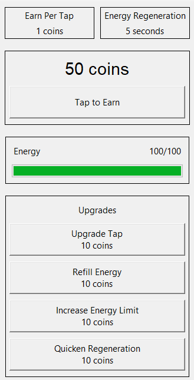

# Tkinter Coin Game
An open-source Python GUI application built using the Tkinter library. It offers players a clicker game in which they can earn coins by tapping and strategically invest them in various upgrades to boost their earnings.

## Screenshots


## Features
- Incremental tapping gameplay for earning coins
- Energy system with regeneration and upgrade options
- Upgrades to increase tap earnings, energy limit, and regeneration speed
- Cost-based mechanics for upgrades and energy refill
- User-friendly GUI with real-time updates and threaded energy regeneration

## Installation
**1. Clone the repository**
```bash
git clone https://github.com/PouyaMT/tkinter-coin-game.git
```

**2. Run the script**
```bash
python main.py
```
